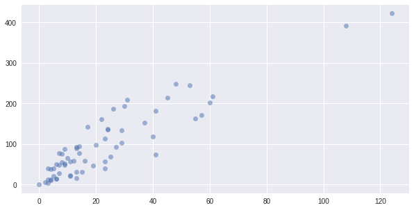
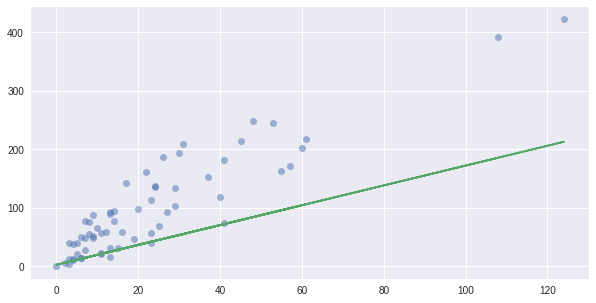
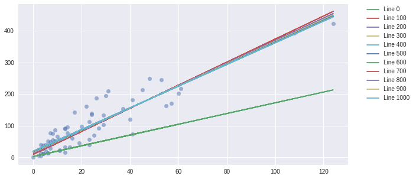

# Linear Regression

I would explain about simple Linear Regression using python module, *Scikit-learn*
We would use many modules to data analysis.


Module | Function
--------|--------
numpy | matrix calculation (using in deep-learning)
pandas | data preprocessing
scikit learn | lots of machinelearning(linear regression, SVM, logstic regression...)
matplotlib | datad visualization
scipy | scientic calculation


Our data analysis process is as follows.

-   [First, preprocessing.](#First,-We-use-pandas-module-to-preprocessing.)
    
-    [Second, EDA(Exploratory Data Analysis), visualization](#Second,EDA-and-visualiztion-data-using-matplotlib)
    
-    [Third,Linear Regression](#Third,Linear-Regression-using-Gradient-Descent)
       - [Using Gradient Descent](#Gradient-Descent)
       - [Using Sickit Learn.](#Linear-Regression-using-Scikit-Learn)
-    [Fourth,Performance Mearsure](#performance-measure)   

---

## First, We use pandas module to preprocessing.


```python
import pandas as pd
import io

df=pd.read_csv(io.StringIO(uploaded['slr06.csv'].decode('utf-8')))

df.head()
```


<div>
<style scoped>
    .dataframe tbody tr th:only-of-type {
        vertical-align: middle;
    }

    .dataframe tbody tr th {
        vertical-align: top;
    }

    .dataframe thead th {
        text-align: right;
    }
</style>
<table border="1" class="dataframe">
  <thead>
    <tr style="text-align: right;">
      <th></th>
      <th>X</th>
      <th>Y</th>
    </tr>
  </thead>
  <tbody>
    <tr>
      <th>0</th>
      <td>108</td>
      <td>392.5</td>
    </tr>
    <tr>
      <th>1</th>
      <td>19</td>
      <td>46.2</td>
    </tr>
    <tr>
      <th>2</th>
      <td>13</td>
      <td>15.7</td>
    </tr>
    <tr>
      <th>3</th>
      <td>124</td>
      <td>422.2</td>
    </tr>
    <tr>
      <th>4</th>
      <td>40</td>
      <td>119.4</td>
    </tr>
  </tbody>
</table>
</div>


```python
import matplotlib.pyplot as plt
%matplotlib inline
import numpy as np
```

---

## Second,EDA and visualiztion data using matplotlib


```python
raw_X = df["X"].values.reshape(-1, 1)
y = df["Y"].values
```


```python
plt.figure(figsize=(10,5))
plt.plot(raw_X,y, 'o', alpha=0.5)
```


    [<matplotlib.lines.Line2D at 0x7f1ae713c080>]





```python
X = np.concatenate( (np.ones((len(raw_X),1)), raw_X ), axis=1) # b값을 1로 초기화시켜주기
X[:5]
```


    array([[  1., 108.],
           [  1.,  19.],
           [  1.,  13.],
           [  1., 124.],
           [  1.,  40.]])


```python
w = np.random.normal((2,1))  # w값 초기화하기. 정규분포 수중에서 뽑아오는 것
# w = np.array([5,3])
w
```


    array([2.9289942 , 1.69365812])


```python
plt.figure(figsize=(10,5))
y_predict = np.dot(X, w)
plt.plot(raw_X,y,"o", alpha=0.5)
plt.plot(raw_X,y_predict)
```


    [<matplotlib.lines.Line2D at 0x7f1ae51122e8>]





---

## Third,Linear Regression using Gradient Descent

###  Define HYPOTHESIS AND COST FUNCTION


```python
def hypothesis_function(X, theta): # 가설함수에 대한 정의
    return X.dot(theta)
```


```python
def cost_function(h, y):  # cost함수에 대한 정의
    return (1/(2*len(y))) * np.sum((h-y)**2)
```


```python
h = hypothesis_function(X,w)
cost_function(h, y)
```


    3013.5223324010303


### Gradient Descent


```python
def gradient_descent(X, y, w, alpha, iterations):# alpha= learning rate
    theta = w # weight값 저장
    m = len(y)
    
    theta_list = [theta.tolist()] 
    cost = cost_function(hypothesis_function(X, theta), y) #scalar 값
    cost_list = [cost]

    for i in range(iterations):
        t0 = theta[0] - (alpha / m) * np.sum(np.dot(X, theta) - y)  # w0값 update
        t1 = theta[1] - (alpha / m) * np.sum((np.dot(X, theta) - y) * X[:,1]) # w1값 update
        theta = np.array([t0, t1]) # 동시에 w값을 update 한다.
        
        if i % 10== 0: #10번째 마다 weight 값과 cost값을 보여준다.
            theta_list.append(theta.tolist())
            cost = cost_function(hypothesis_function(X, theta), y)
            cost_list.append(cost)


    return theta, theta_list, cost_list
```

### linear regression with GD


```python
iterations = 10000
alpha = 0.001

theta, theta_list, cost_list = gradient_descent(X, y, w, alpha, iterations)

print("theta:", theta)
print('cost:', cost_function(hypothesis_function(X, theta), y))
```

    theta: [19.88600506  3.41616592]
    cost: 625.3739400539721
    


```python
cost_list[:5]
theta_list = np.array(theta_list)
```


```python
plt.figure(figsize=(10,5))

y_predict_step= np.dot(X, theta_list.transpose())

y_predict_step
plt.plot(raw_X,y,"o", alpha=0.5)
for i in range (0,len(cost_list),100):
    plt.plot(raw_X,y_predict_step[:,i], label='Line %d'%i)

plt.legend(bbox_to_anchor=(1.05, 1), loc=2, borderaxespad=0.)
plt.show()
```





---

### Linear Regression using Scikit-Learn


```python
from sklearn.datasets import load_boston
import matplotlib.pyplot as plt
import numpy as np
```


```python
#data 불러오기
boston = load_boston()
boston["data"]
x_data = boston.data
y_data = boston.target.reshape(boston.target.size,1)

x_data[:3]
```


    array([[6.3200e-03, 1.8000e+01, 2.3100e+00, 0.0000e+00, 5.3800e-01,
            6.5750e+00, 6.5200e+01, 4.0900e+00, 1.0000e+00, 2.9600e+02,
            1.5300e+01, 3.9690e+02, 4.9800e+00],
           [2.7310e-02, 0.0000e+00, 7.0700e+00, 0.0000e+00, 4.6900e-01,
            6.4210e+00, 7.8900e+01, 4.9671e+00, 2.0000e+00, 2.4200e+02,
            1.7800e+01, 3.9690e+02, 9.1400e+00],
           [2.7290e-02, 0.0000e+00, 7.0700e+00, 0.0000e+00, 4.6900e-01,
            7.1850e+00, 6.1100e+01, 4.9671e+00, 2.0000e+00, 2.4200e+02,
            1.7800e+01, 3.9283e+02, 4.0300e+00]])


```python
#데이터 스케일링
from sklearn import preprocessing

minmax_scale = preprocessing.MinMaxScaler(feature_range=(0,5)).fit(x_data)
# standard_scale = preprocessing.StandardScaler().fit(x_data)
x_scaled_data = minmax_scale.transform(x_data) #적용

x_scaled_data[:3]
```


    array([[0.00000000e+00, 9.00000000e-01, 3.39076246e-01, 0.00000000e+00,
            1.57407407e+00, 2.88752635e+00, 3.20803296e+00, 1.34601570e+00,
            0.00000000e+00, 1.04007634e+00, 1.43617021e+00, 5.00000000e+00,
            4.48399558e-01],
           [1.17961270e-03, 0.00000000e+00, 1.21151026e+00, 0.00000000e+00,
            8.64197531e-01, 2.73998850e+00, 3.91349125e+00, 1.74480990e+00,
            2.17391304e-01, 5.24809160e-01, 2.76595745e+00, 5.00000000e+00,
            1.02235099e+00],
           [1.17848872e-03, 0.00000000e+00, 1.21151026e+00, 0.00000000e+00,
            8.64197531e-01, 3.47192949e+00, 2.99691040e+00, 1.74480990e+00,
            2.17391304e-01, 5.24809160e-01, 2.76595745e+00, 4.94868627e+00,
            3.17328918e-01]])


```python
# test,trainset 분리하기
from sklearn.model_selection import train_test_split

X_train, X_test, y_train, y_test = train_test_split(x_scaled_data, y_data, test_size=0.33)
X_train.shape, X_test.shape, y_train.shape, y_test.shape
```


    ((339, 13), (167, 13), (339, 1), (167, 1))


```python
from sklearn import  linear_model

regr = linear_model.LinearRegression(fit_intercept=True, 
                                     normalize=False, 
                                     copy_X=True, 
                                     n_jobs=2 )#몇개의 cpu를 쓸것이냐
regr.fit(X_train, y_train) # 데이터를 학습시킨다.
# # The coefficients
print('Coefficients: ', regr.coef_) # w값이 나온다.
print('intercept: ', regr.intercept_) # 절편의 값이 나온다.
```

    Coefficients:  [[-1.42869207  0.82789593  0.07650219  0.47066037 -1.43254438  4.29278862
      -0.36401695 -3.49036959  1.23317417 -1.25641875 -1.75140863  0.88875591
      -3.66849796]]
    intercept:  [26.15511394]
    


```python
regr.predict(x_data[0].reshape(1,-1)) # x_data[-].dot(regr.coef_.T)+regr.intercept_ 같은 것이다
```


    array([[-32.31543594]])


```python
# 평가지표 만들어보기
from sklearn.metrics import r2_score
from sklearn.metrics import mean_absolute_error
from sklearn.metrics import mean_squared_error

y_true = y_test # y의 실제값
y_hat = regr.predict(X_test) # y의 예측값

r2_score(y_true, y_hat), mean_absolute_error(y_true, y_hat), mean_squared_error(y_true, y_hat)
```


    (0.7231922231699222, 3.5105227327197603, 23.372319077131536)


## performance **measure**

 ***Evaluation Standard***
 - Mean Absolute Error (MAE) : Linear Regression using Gradient Descent
 - Root Mean Squared Error(RMSE) : Root of sum of residual squares
 - R squared : The larger the number between 0 and 1, the better the fit
 
 
***Separate the data that creates the model (Train) and the data that is evaluated (Test).***
 - Can be used with models that are overfitting the training data
 - When new data emerges, there is a difference from existing models
 - The model should be genralized so that new data can be processed
 - Separate training set and test set for this
 


---

> Reference Site

>> [머신러닝기초](https://github.com/TeamLab/machine_learning_from_scratch_with_python)

>>   [평가지표](https://en.wikipedia.org/wiki/Mean_absolute_error)
