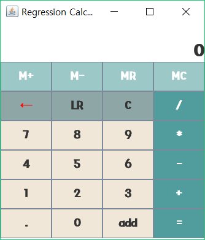

# Regression Calculator Project

## How to Use?
### First, You can use +,-,*,/
    - First you push numberButton(or keyboard) 
    - Second, you push operationButton(+,-,*,/)
    - Third,you push  numberButton
    - Finally,you push  =(enter) Button
      Then you can get result!
### Second, You can use memory function(M+,M-,MC,MR)
    -First, if you push M+, then calculator remember the number on the display.
    -Second, if you push M-, then calculator - memory Value.
    -Third, if you push MC, then display the MemoryValue;
    -Finally, if you push MR, then remove MemoryValue;
 
### Third, You can use Linear Regression Function(LR,add)
    -First, if you push LR button, then Calculator ask "how many Variables ?"
    -Second, you push number button, then push add button and number button(until,Calculator display "please        push the enter"
    -Third, you push the =(enter) button, then you can get a predict value
 ## Calculator Image
 

##How to make?
### Using OOP
- Calculator Class
>It has many innerclass and operfunction(+,-,/,*,LR) , init fuction, UI function.
innerclass:basicbutton,operbutton,memorybutton,textResult,memoryLabel   
operfunction: calculate, basic oper, linear Regression      
init() : keybord Listener, init memoryvalue     
create UI(): create panel and add button,Label ... 

- basicbutton Class
> It extends JButton class. init button theme( font, size ...), add btnclicklistener . 
- operbutton Class
> It extends basicbutton class. using override actionPerformed fuction. (to calculate oper function)
- memorybutton Class
> It extends basicbutton class. using override actionPerformed function.(to use memory fuction)
- textResult Class
> It extends JTextField. init result theme( font, size ..)
- memoryLabel Class
> It extends JLabel. init result theme(font,size...)

## Using GUI
- JFrame
> add two Panel( button panel, result panel) 
- JPanel
> Button panel: add Button components     
  Result panel: add textField and Label(show memory function)
- JTextField
> show numbers
- JLabel
> show memory function
- JButton
> button
- keybordListener
> when you push your keybord, calculator can react using this Listener
- ActionListener
> when you push button, calculator can react using this Listener